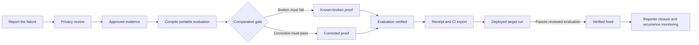
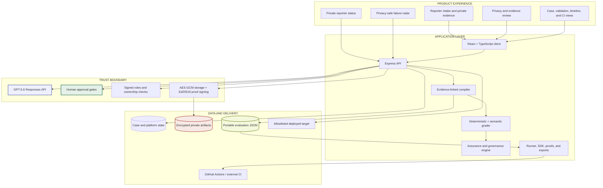
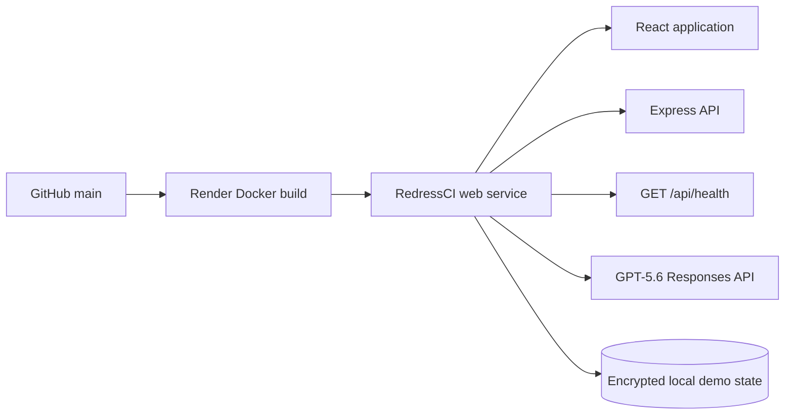
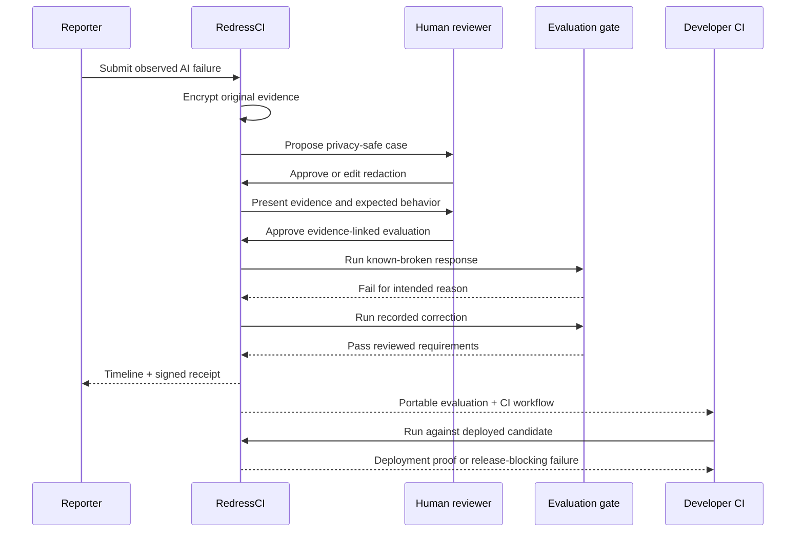
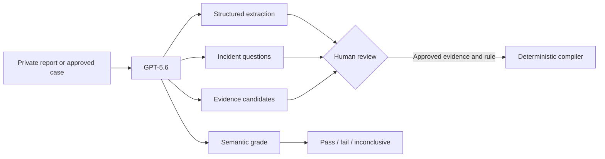

# RedressCI — From AI Failure to Verified Fix

[](https://nodejs.org/)
[](https://www.typescriptlang.org/)
[](https://developers.openai.com/api/docs/models/gpt-5.6-sol)
[](https://redressci.onrender.com)
[](https://github.com/ankitlade12/redressci/actions/workflows/redressci.yml)
[](#reproducible-testing)
[](LICENSE)

> **A closed ticket says someone tried. RedressCI proves the fix and keeps testing it.**

RedressCI is an AI remediation and continuous-assurance platform. It turns a reported AI failure into a privacy-safe, evidence-backed regression test, proves that the test catches the broken behavior, recognizes the correction, and carries that protection into CI.

The product begins with the person who experienced the failure—not with a dataset an engineering team already owns. Reporters retain a visible path to closure while reviewers and developers receive only the evidence and artifacts appropriate to their roles.

**OpenAI Build Week track:** Developer Tools<br>
**Demo data:** entirely fictional and synthetic<br>
**Hosted product:** <https://redressci.onrender.com>

## Quick Highlights

- **Reporter-to-CI Remediation** — one governed path from a real-world experience to permanent regression protection
- **Privacy Before Engineering Access** — original evidence remains separate until a human approves the redacted case
- **Evidence-Backed Assertions** — every compiled check cites an approved source; changed evidence invalidates dependents
- **Comparative Proof** — the same evaluation must fail on the known-broken response and pass on the correction
- **Truthful Verification States** — recorded-response proof and deployed-system verification are labeled separately
- **Visible Reporter Closure** — private status links, consent withdrawal, timelines, signed receipts, and deployment proof
- **GPT-5.6 With Boundaries** — AI extracts, structures, discovers, and grades; humans approve truth and authority
- **CI-Native Protection** — portable JSON evaluations, a standalone runner, GitHub Actions, and optional Checks API output
- **Measured Evaluation Quality** — mutation detection, calibration, repeat stability, scope guarding, and inconclusive outcomes
- **Privacy-Safe Network Learning** — recurring mechanisms surface only after minimum-group privacy thresholds are met

## Live Deployment

| Surface | URL | Access |
|---|---|---|
| **Product** | <https://redressci.onrender.com> | Public synthetic judge workspace |
| **Health check** | <https://redressci.onrender.com/api/health> | Public JSON status |
| **Reporter status** | `/status/:token` | Expiring and revocable private link |
| **Portable runner** | [`runner/cli.ts`](runner/cli.ts) | Local or CI execution |
| **GitHub workflow** | [`.github/workflows/redressci.yml`](.github/workflows/redressci.yml) | Repository CI |

The hosted workspace is intentionally resettable and credential-free for judging. GPT-5.6 is configured on the server, while deterministic fixtures keep the primary demo reliable. The public deployment is a synthetic demonstration—not a destination for sensitive reports.

## Architecture Overview

### The Remediation Loop



### System Architecture



### Hosted Runtime



The central design rule is enforced in code: **GPT-5.6 may propose and grade, but only reviewed evidence, human approval, and successful execution can establish verified status.**

### Tech Stack

| Layer | Technology | Purpose |
|---|---|---|
| **Interface** | React + Vite | Reporter, reviewer, developer, verifier, and status-link experiences |
| **Language** | TypeScript in strict mode | Shared contracts across product, API, runner, and SDK |
| **API** | Node.js 22 + Express | Workflow enforcement, role boundaries, artifacts, and exports |
| **Model layer** | OpenAI GPT-5.6 Responses API | Extraction, incident structuring, evidence discovery, and semantic grading |
| **Deterministic evaluation** | Custom compiler and grader | Evidence-linked rules, comparative gate, and portable results |
| **Private storage** | AES-256-GCM artifact boundary | Encryption of reporter-supplied private evidence |
| **Proof** | Ed25519 signatures + SHA-256 | Receipts, deployment proof, proof bundles, and tamper detection |
| **CI** | Standalone TypeScript runner + GitHub Actions | Release regression protection and machine-readable results |
| **Deployment** | Docker + Render | Hosted judge build and health checks |
| **Production foundation** | PostgreSQL migration + vendor-neutral SDK | Design-partner persistence and interoperability path |

## The Problem

An AI failure usually becomes a support ticket, screenshot, or incident entry. Even when a team closes the ticket, three questions remain unanswered:

- Was the harmful behavior reproduced for the intended reason?
- Did the correction actually satisfy an evidence-backed expectation?
- Will the same failure be caught after the next prompt, model, retrieval, or code change?

Traditional incident databases preserve memory. Evaluation platforms test developer-owned datasets. Support systems track resolution status. The person who experienced the failure is rarely connected to executable proof or lasting engineering protection.

**A report should not disappear into a queue. It should become a test that stays fixed.**

## The Solution

RedressCI creates a governed remediation record:

1. A reporter submits the observed interaction and impact using text, an attachment, or editable voice dictation.
2. The original evidence starts private and is stored separately from the shareable case.
3. A reviewer inspects the proposed redaction and explicitly approves the privacy-safe version.
4. Evidence, expected behavior, assertions, and recorded targets receive separate human approval.
5. RedressCI compiles a portable evaluation in which every assertion cites approved evidence.
6. The known-broken response must fail and the recorded correction must pass under the same grader policy.
7. The reporter receives a timeline and signed Redress Receipt; the developer receives a CI-ready test.
8. A separate live-adapter run is required before the product may claim the deployed system is verified fixed.

The result is not another issue tracker or evaluation dashboard. It is a remediation compiler connecting experience, evidence, proof, closure, and release protection.

## Remediation Lifecycle



## Product Features

### Guided Reporting and Private Evidence

- Non-technical, three-step affected-person intake
- Separate internal-incident intake for authorized developers
- Text, PNG, JPG, WebP, PDF, and private attachment handling
- Permission-aware browser dictation that stores only submitted text—not audio
- Encrypted artifact storage with case ownership checks
- Explicit consent scope and append-only consent history

### Human-Owned Privacy and Evidence

- Proposed redaction for names, email, phone, and account identifiers
- Side-by-side original and shared review for authorized roles
- Leak rechecking after manual edits
- Versioned evidence with exact assertion and evaluation dependencies
- Reviewer-controlled evidence discovery candidates
- Compilation blocked when reviewed material still appears to contain personal data

### Evidence-Backed Evaluation Compilation

- Provider-neutral JSON evaluation format
- Forbidden-entity, required-concept, semantic-rubric, and tool-trajectory assertions
- Assertion-level evidence citations
- General expected-behavior rule kept distinct from candidate response text
- Deterministic checks remain deterministic
- Semantic checks preserve explicit pass, fail, or inconclusive outcomes

### Comparative and Deployed Proof

- Known-broken target must fail for the intended reason
- Recorded correction must pass the same evaluation
- Both runs share one immutable grader-policy hash
- `Evaluation verified` never implies that a live deployment was called
- `Verified fixed` requires an allowlisted live-system run
- Separate signed deployment proof records endpoint origin, version, hashes, and results

### Reporter Closure

- Plain-language remediation timeline
- Expiring and revocable private status links
- Notification preferences and consent withdrawal
- Signed Redress Receipt containing evaluation and proof hashes
- No original identity or artifact content in portable receipts

### CI and Remediation Network

- Standalone runner with non-zero regression exit codes
- Downloadable GitHub Actions workflow for deployed-target checks
- Optional GitHub Checks API publishing
- TypeScript interoperability SDK
- LangSmith, Braintrust, Langfuse, and OECD-compatible exports
- SLO, recurrence, release-blocking, and integration-delivery records

### Assurance and Community Governance

- Mutation lab with severity-aware detection policy
- Rule/model calibration and inconclusive-rate reporting
- Repeat-run stability with a Wilson 95% confidence interval
- Neighboring privacy and fix-scope regression guard
- Reviewed language, location, phrasing, and assistive-need variations
- Signed proof bundles, evidence pins, and hash-chained audit events
- Privacy-thresholded recurring-failure radar
- Encrypted evaluation escrow for independent verification

## Judge Quick Start

### Hosted Demo

No installation or credentials are required:

<https://redressci.onrender.com>

1. Review the four-stage judge path: **Report → Review → Prove → Prevent regression**.
2. Read the GPT-5.6 card explaining where the model adds value and where human authority remains mandatory.
3. Select **Start the guided demo**.
4. Open **Evidence** and **Evaluation** to inspect the approved source and linked assertions.
5. Open **Validation** and select **Re-run validation**.
6. Confirm the recorded broken response fails and the correction passes under the same grader policy.
7. Open **CI export** to inspect or download the portable evaluation, receipt, and GitHub workflow.
8. Use **View privacy boundary as** to compare Reporter, Reviewer, Developer, Administrator, and Verifier access.

### Local Installation

Requirements: Node.js 22+ and npm. The project is tested on macOS and designed to run on Linux and Windows.

```bash
git clone https://github.com/ankitlade12/redressci.git
cd redressci
npm ci

cp .env.example .env
# OPENAI_API_KEY is optional for the deterministic synthetic path.

npm run dev
```

Open <http://localhost:5173>. Without an OpenAI key, the seeded comparative demo and deterministic CI runner remain usable.

### Fresh Report Walkthrough

Select **Report a failure** and use the seeded CivicAid accessibility scenario or your own entirely synthetic information. Do not submit personal or sensitive data to the public demo.

1. Submit a transcript and optional private artifact.
2. Compare the original with the proposed redaction and approve the shared version.
3. Add an exact evidence passage and approve a general expected-behavior rule.
4. Define forbidden, required, and semantic checks tied to that evidence.
5. Register the reported response and a distinct candidate correction.
6. Compile the test and run the comparative gate.
7. Create a private reporter status link or export the CI evaluation.

## GPT-5.6 Integration

GPT-5.6 is a working product dependency—not a decorative chatbot. The server uses the Responses API with strict JSON schemas for:

- **Multimodal extraction** — recover the visible user/assistant interaction from text or an image while retaining uncertain text
- **Incident structuring** — propose a title, summary, expected behavior, category, severity, audience, and unanswered questions
- **Evidence discovery** — search for public authoritative candidates using privacy-approved text only
- **Semantic grading** — evaluate nuanced behavior using the approved rubric and evidence while preserving inconclusive outcomes



Uploaded content is treated as untrusted data, never model instructions. GPT-5.6 cannot approve privacy, consent, evidence, expected behavior, or verified status. Live AI routes are rate-limited, response sizes are bounded, and credentials remain server-side.

To enable the live AI path locally:

```bash
cp .env.example .env
# Set OPENAI_API_KEY and optionally OPENAI_MODEL, then restart npm run dev.
```

## Reproducible Testing

```bash
# Complete unit and API integration suite
npm test

# Strict TypeScript validation
npm run lint

# Production client build
npm run build

# Portable corrected-target evaluation
npm run test:ci

# Demonstrate the expected regression failure
node --import tsx runner/cli.ts evals/cooling-center-accessibility-001.json --target broken
```

Current verified result:

```text
Tests  37 passed (37)
Lint   passed
Build  passed
CI     corrected target passed; known-broken target exits non-zero
```

Coverage includes privacy gates, ownership, role-token tampering, personal-data leak blocking, evidence approval, dependency invalidation, compilation, comparative validation, immutable grader provenance, signed receipts and proofs, mutation detection, stability, calibration, reporter links, live verification, GitHub workflow generation, privacy thresholds, browser routing, and voice-input behavior.

## Commands

| Command | Purpose |
|---|---|
| `npm run dev` | Start the Express API and Vite client in watch mode |
| `npm run build` | Type-check and produce the production client bundle |
| `npm start` | Serve the production API and built client on `PORT` or `8787` |
| `npm test` | Run all 37 product, privacy, compiler, API, and runner tests |
| `npm run test:ci` | Execute the portable cooling-center evaluation against the corrected target |
| `npm run lint` | Run strict TypeScript validation without emitting files |
| `npm run auth:token -- ...` | Issue a signed role token for an authenticated deployment |

## Project Structure

```text
redressci/
├── src/                         # React product interface, routing, shared types
├── server/                      # API, OpenAI integration, privacy, compiler, proof
├── runner/                      # Portable CLI evaluation runner
├── sdk/                         # Vendor-neutral TypeScript interoperability client
├── db/migrations/               # Managed PostgreSQL production schema
├── evals/                       # Privacy-safe portable evaluation fixtures
├── fixtures/                    # Synthetic evidence and product data
├── scripts/                     # Operational token tooling
├── data/                        # Ignored private runtime boundaries; .gitkeep only
├── .github/workflows/           # Repository and exported CI workflows
├── RedressCI_Feature_Specification.md
├── Dockerfile
├── render.yaml
├── package.json
└── .env.example
```

## Configuration

The deterministic judge path does not require secrets. For authenticated or integration-enabled environments, copy `.env.example` and configure values in the deployment platform's encrypted secret store.

```bash
# OpenAI
OPENAI_API_KEY=
OPENAI_MODEL=gpt-5.6
REDRESSCI_AI_RATE_LIMIT_PER_HOUR=20

# Identity and persistence
REDRESSCI_AUTH_REQUIRED=1
REDRESSCI_AUTH_SECRET=
REDRESSCI_PERSIST=1
REDRESSCI_STORAGE_REGION=us

# Private storage and proof
REDRESSCI_STORAGE_KEY=
REDRESSCI_ESCROW_KEY=
REDRESSCI_SIGNING_PRIVATE_KEY=

# Live deployed-target verification
REDRESSCI_TARGET_ALLOWLIST=api.example.org
REDRESSCI_TARGET_TOKEN=

# Optional GitHub Checks publication
REDRESSCI_GITHUB_REPOSITORY=owner/repository
REDRESSCI_GITHUB_TOKEN=
```

Never commit `.env`. Generated evaluations exclude credentials and original artifacts. Live target URLs must use HTTPS and match `REDRESSCI_TARGET_ALLOWLIST`; credentials are resolved only from named server environment variables.

## Deploying to Render

The repository includes [`Dockerfile`](Dockerfile) and [`render.yaml`](render.yaml), so Render can deploy directly from `main`.

1. Create a Render web service connected to this repository.
2. Use the repository's Docker runtime configuration.
3. Add `OPENAI_API_KEY` and any optional integration secrets in Render—not in Git.
4. Keep generated auth, storage, and escrow secrets stable across deployments.
5. Deploy and verify `GET /api/health`.
6. Keep demo mode isolated from any environment that accepts real sensitive reports.

For a real design-partner deployment, replace local snapshots with transactions over [`db/migrations/001_all_phases.sql`](db/migrations/001_all_phases.sql), move encrypted artifacts to regional object storage and KMS, connect an identity provider, and add backup, monitoring, deletion, and abuse-response operations.

## API Surface

The primary implemented routes include:

```text
GET    /api/health
GET    /api/cases
GET    /api/cases/:id
POST   /api/cases
POST   /api/cases/:id/artifacts
POST   /api/cases/:id/extract
POST   /api/cases/:id/redact
POST   /api/cases/:id/structure
POST   /api/cases/:id/evidence
POST   /api/cases/:id/evidence/:evidenceId/review
POST   /api/cases/:id/review-expected-behavior
PUT    /api/cases/:id/assertions
PUT    /api/cases/:id/targets
POST   /api/cases/:id/compile
POST   /api/cases/:id/validate
POST   /api/cases/:id/live-verify
GET    /api/cases/:id/deployment-proof
POST   /api/cases/:id/reporter-link
POST   /api/cases/:id/evidence/discover
GET    /api/cases/:id/github-workflow
POST   /api/cases/:id/github-check
GET    /api/cases/:id/export
GET    /api/cases/:id/receipt

GET    /api/platform
GET    /api/platform/audit
POST   /api/cases/:id/assurance
GET    /api/cases/:id/proof
POST   /api/platform/proofs/verify
POST   /api/cases/:id/counterfactuals
POST   /api/cases/:id/escrow
GET    /api/cases/:id/export/:provider
GET    /api/cases/:id/oecd
GET    /api/cases/:id/slo
POST   /api/cases/:id/recurrences
GET    /api/platform/patterns

GET    /api/public/status/:token
PUT    /api/public/status/:token/preferences
GET    /api/public/status/:token/receipt
POST   /api/public/status/:token/withdraw
```

## Safety and Privacy Boundaries

- All seeded demonstrations and repository fixtures are synthetic.
- Original evidence and encrypted artifacts are excluded from Git.
- Reporter ownership is enforced for artifact upload, extraction, download, and privacy approval.
- Developer access to a community case omits the reporter name, original transcript, artifacts, and unapproved narrative.
- Uploaded formats and size are restricted; uploaded content is never executed.
- Model output cannot directly change consent, evidence approval, or verification state.
- Assertions cannot compile without approved evidence references.
- Reviewed evidence and assertion values are rescanned for apparent personal data before compilation.
- Evidence changes invalidate dependent assertions, evaluations, packs, receipts, and proofs.
- Inconclusive grading remains explicit and cannot silently become a pass.
- Aggregate failure groups below the privacy threshold are suppressed.
- Signed proof and receipt verification fails after payload tampering.
- `Evaluation verified` is scoped recorded-response proof—not a system-wide safety certification.

## Why RedressCI Is Different

| Capability | Support ticket | Incident database | Eval platform | RedressCI |
|---|:---:|:---:|:---:|:---:|
| Starts with an affected person's experience | ✅ | ✅ | ⚠️ | ✅ |
| Keeps originals behind a governed privacy boundary | ⚠️ | ⚠️ | ⚠️ | ✅ |
| Requires human-approved evidence for expected behavior | ❌ | ❌ | ⚠️ | ✅ |
| Compiles the report into a portable regression test | ❌ | ❌ | ✅ | ✅ |
| Requires known-broken failure and corrected success | ❌ | ❌ | ⚠️ | ✅ |
| Separates recorded proof from deployed verification | ❌ | ❌ | ⚠️ | ✅ |
| Gives the reporter a signed remediation receipt | ❌ | ❌ | ❌ | ✅ |
| Exports lasting protection into release CI | ❌ | ❌ | ✅ | ✅ |
| Invalidates tests when supporting evidence changes | ❌ | ❌ | ⚠️ | ✅ |

The novelty is the combination: **affected-person intake + governed privacy + executable evidence + comparative proof + reporter closure + CI enforcement.** RedressCI connects accountability to the engineering system that can keep a failure from returning.

## How Codex Shaped the Product

The majority of RedressCI was built with Codex during OpenAI Build Week. Codex accelerated the work across product, engineering, research, verification, and deployment:

- translated the product specification into a complete vertical architecture;
- researched the challenge requirements and adjacent incident, evaluation, and redress products;
- implemented the React interface, Express API, compiler, runner, SDK, and proof system;
- identified high-risk claims and enforced truthful state transitions in server logic;
- built privacy, workflow, evaluation, platform, routing, and voice regression tests;
- diagnosed browser navigation, semantic-grader provenance, evidence-review, and dictation failures;
- created the Docker and Render deployment flow and GitHub review workflow; and
- iterated on demo clarity, GPT-5.6 visibility, documentation, and submission readiness.

Human product decisions remained explicit: begin with the affected person, require reviewed evidence before assertions, keep private originals separate, demand comparative proof before evaluation verification, and reserve deployed-fix claims for live-system evidence.

## Production Boundary

RedressCI is a working, deployed, end-to-end hackathon product. The hosted environment is intentionally configured as a synthetic judge workspace.

Before accepting sensitive external reports, a deployment must add managed identity, durable PostgreSQL storage, regional object storage and KMS, malware and abuse controls, monitoring, backups and restore drills, deletion operations, published privacy and retention policies, and a named response process.

This boundary is deliberate: the product demonstrates credible remediation without pretending that hackathon infrastructure is already a public-interest reporting service.

## Future Enhancements

- Managed organizational identity, invitations, reviewer assignment, and account recovery
- PostgreSQL-backed multi-tenant case persistence
- Regional object storage, KMS, retention, deletion, and restoration workflows
- Real notification delivery and reporter communication preferences
- Guided GitHub, GitLab, Jira, Linear, Slack, Teams, and webhook integrations
- Multilingual reporter journeys and formal WCAG 2.2 AA acceptance testing
- Domain-reviewer assignment, conflicts, compensation, and independent verification
- Governed community evaluation packs and cross-organization recurrence signals
- Activation and remediation metrics from real design-partner pilots

## OpenAI Build Week Submission

- **Category:** Developer Tools
- **Required tools:** Codex and GPT-5.6
- **Hosted product:** <https://redressci.onrender.com>
- **Repository:** <https://github.com/ankitlade12/redressci>
- **Codex session ID:** `019f7687-61f4-7250-9ff7-224899bfc3b6`
- **License:** MIT

The public demo uses synthetic data, requires no credentials, and exposes a guided testing path. The video script is designed to remain below three minutes while explicitly demonstrating both Codex's contribution and GPT-5.6's role in the running product.

## License

[MIT](LICENSE) © 2026 Ankit Hemant Lade, Sai Krishna Jasti, and RedressCI contributors.

---

**Built for OpenAI Build Week — Developer Tools.**

*Report the failure. Review the evidence. Prove the fix. Prevent the regression.*
